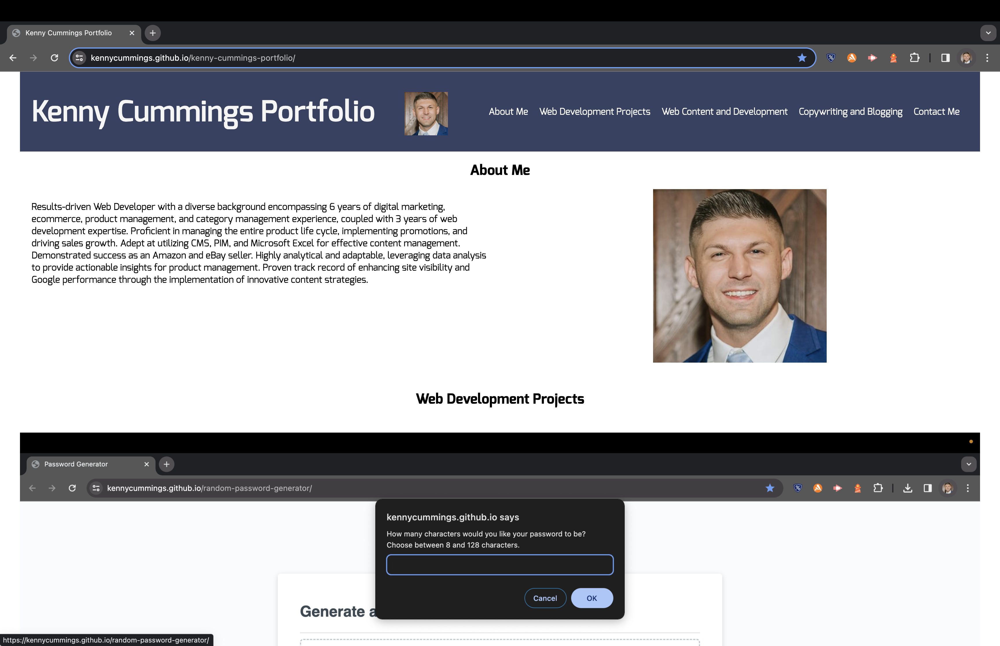
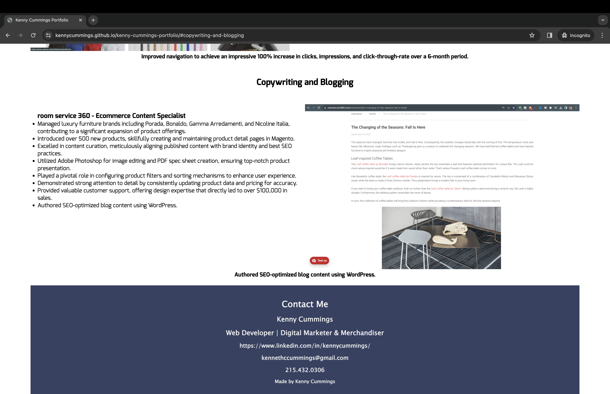

# kenny-cummings-portfolio
Kenny Cummings Professional Work Portfolio
 
 
The goal of this is to create a professional work portfolio to showcase to potential employers. 
I have a wide variety of experience in ecommerce and marketing. I recently pivoted to web development.
 
I am learning a great deal of HTML and CSS in the process.
 
The end product is a simple, clean, and aesthetic website.
 
I decided to go with a dark blue background for my header and footer with white font to compliment them.
This helps my project pop without being too busy.
 
I played with negative space by switching the image and text positions of my experience at room service 360.
 
The header links scroll down to Web Content and Development and Copywriting and Blogging bodies instantaneously.
 
I decided to use my resume bullet points and displayed them using "ul" and "li" tags.
 
I played with the footer for a while to get the alighnment of each either far left or far right. I did this using "style" in HTML.
 
 

 
 

