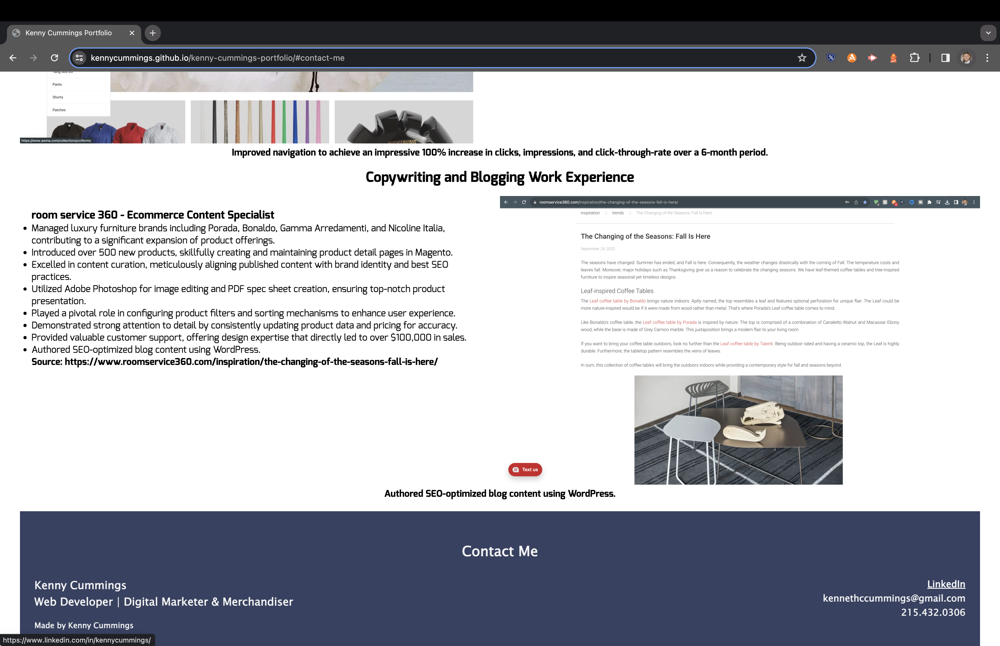

# kenny-cummings-portfolio
Kenny Cummings Professional Work Portfolio
 
 
The goal of this is to create a professional work portfolio to showcase to potential employers. I have a wide variety of experience in ecommerce and marketing and have recently pivoted to web development.
 
I am learning a great deal of HTML and CSS in the process.
I decided to go with a dark blue background for my header with white font to compliment it.
 
In addition, I placed my LinkedIn profile picture in the header by assigning it to the "header" class.
 
I placed links to scroll down to Web Content and Development and Copywriting and Blogging headers in an instant.
 
I decided to use my resume bullet points and displayed them using "ul" and "li" tags.
 
I played with the footer for a while to get the alighnment of each either far left or far right. I did this using "style" in HTML.
 
 

